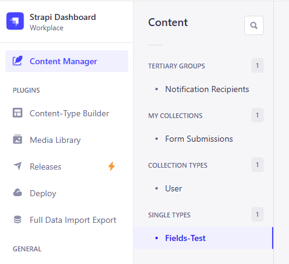

# Strapi Plugin: content-groups

**Customize the Content Manager sidebar in Strapi by grouping your Content Types.**

> ⚠️ Experimental plugin using plain JavaScript injected after page load. Behavior may vary across different Strapi versions.



## ✨ Features

- Organize your Content Types into custom groups.
- Cleaner and more intuitive sidebar in the Content Manager.
- Zero config required in the Strapi admin panel.
- Lightweight and non-intrusive.

## 🛠️ Installation

```bash
npm install strapi-plugin-content-groups
```

Or if using yarn:

```bash
yarn add strapi-plugin-content-groups
```

⚙️ Configuration
The custom groups can be configured in admin -> settings -> custom groups configs.

🚧 Limitations
Uses plain JavaScript to manipulate the DOM after admin panel load.

Not officially supported by Strapi and may break with future updates.

Tested on Strapi v4.x; compatibility with other versions is not guaranteed.

🧪 Development Notes
This plugin does not use Strapi’s official plugin API for admin panel extensions. Instead, it waits for the page to load and rearranges the sidebar items by modifying the DOM directly.

This method is fragile but provides a quick way to improve content organization until native grouping is supported.

Enjoy a cleaner sidebar — even if it's duct-taped together. 😉
